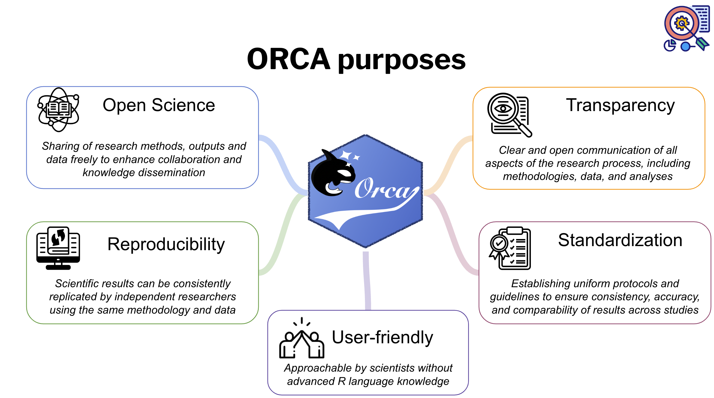
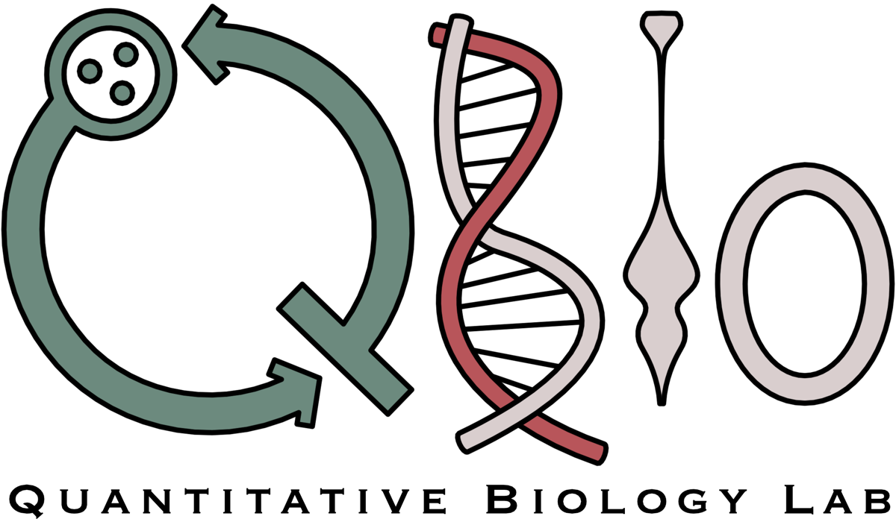

# ORCA: Omni Reproducible Cell Analysis

<p align="center">
  
</p>

**A cellular biologist’s toolbox for data analysis.**

ORCA provides an exhaustive platform where scientists can analyze raw data from:

- Western Blot (WB)
- Reverse Transcription-quantitative PCR (RT-qPCR)
- Enzyme-Linked ImmunoSorbent Assay (ELISA)
- Endocytosis
- Cytotoxicity
- Immunofluorescence
- Flow Cytometry analysis experiments

<p align="center">
    
</p>

## Required Installed Packages

The following R packages must be installed:

```r
install.packages(c("rjson", "openxlsx", "patchwork", "ggplot2", "shinydashboard", 
                   "shinyWidgets", "shiny", "dashboardthemes", "dplyr", "OpenImageR", 
                   "knitr", "zoo", "shinythemes", "readxl", "DT", "shinyjs","randomcoloR"))
```

## How to Install

To install ORCA, you can use **devtools**:

```r
install.packages("devtools")
devtools::install_github("qBioTurin/ORCA", ref="main", dependencies=TRUE)
```

## How to Run

To run the Shiny application:

```r
ORCA::ORCA.run()
```

## Docker

You need to have Docker installed on your machine. For more information, see the [Docker installation guide](https://docs.docker.com/engine/installation/).

To download all the Docker images used by **ORCA**, you can use:

```r
library(ORCA)
downloadContainers()
```

The Docker images are freely available at the following [link](https://hub.docker.com/r/qbioturin/).

## How to Run the Application with Docker

To run the ORCA application through its Docker image, use the following R function:

```r
library(ORCA)
docker.application.run()
```

## Dataverse Communication

The uploading of the analysis can be done using the *Dataverse* panel in the application. In this context, a Docker image can be utilized.


## Diclaimer:
ORCA developers have no liability for any use of ORCA functions, including without limitation, any loss of data, incorrect results, or any costs, liabilities, or damages that result from the use of ORCA. 

## How to cite

Tortarolo D., Pernice S. et al. "*OmniReprodubileCellAnalysis: a comprehensive toolbox for the analysis of cellular biology data.*" 2023 IEEE International Conference on Bioinformatics and Biomedicine (BIBM). IEEE, 2023.

```
@inproceedings{tortarolo2023ORCA,
  title={OmniReprodubileCellAnalysis: a comprehensive toolbox for the analysis of cellular biology data},
  author={Tortarolo, Dora and Pernice, Simone and Clapero, Fabiana and Valdembri, Donatella and Serini, Guido and Riccardo, Federica and Tarone, Lidia and Bena, Chiara Enrico and Bosia, Carla and Contaldo, Sandro Gepiro and others},
  booktitle={2023 IEEE International Conference on Bioinformatics and Biomedicine (BIBM)},
  pages={3748--3755},
  year={2023},
  organization={IEEE}
}

```

# NEWS

Dear ORCA users,

We are writing to notify of relevant changes to the Western Blot (WB) quantification formula in the new version of ORCA released on June 3rd 2024. 
In the latest version of ORCA, the WB quantification formula has been updated to allow comparison between different WB experiments. Specifically,  the Relative Density (*RD*) for both the Gene Of Interest (*GOI*) and the Normaliser Gene (NG) is now calculated as follows: 

 - $RD_{baseline} = WB_{GOI}[samplebaseline] / WB_{GOI}[samplebaseline]$, 
 - $RD_2 =WB_{GOI}[sample_2] / WB_{GOI}[samplebaseline]$, 
 -  …,
 - $RD_n = WB_{GOI}[sample_n] / WB_{GOI}[samplebaseline]$, 

 and similarly for the NG, allowing the RD of the first sample to be equal to 1. 

Consequently, the Adjusted Relative Density (*ADJ*) is calculated as follows: 

 - $ADJ_{baseline} = RD_{GOI}[samplebaseline] / RD_{NG}[samplebaseline]$,
 - $ADJ2 = RD_{GOI}[sample_2] / RD_{NG}[sample_2]$,
 - $…$, 
 - $ADJn = RD_{GOI}[sample_n] / RD_{NG}[sample_n]$.

We would like to inform you that there is a public record of the different versions of ORCA on GitHub. The relevant links are as follows:

  First version (as of June 3rd 2024): [ORCA branch v1.0](https://github.com/qBioTurin/ORCA/tree/v1.0),
  Current version: [ORCA branch main](https://github.com/qBioTurin/ORCA)

We thank you for your attention and wish you a smooth ORCA experience!

The Authors.

<p align="center">
  <a href="https://qbio.di.unito.it/">
    
  </a>
</p>
